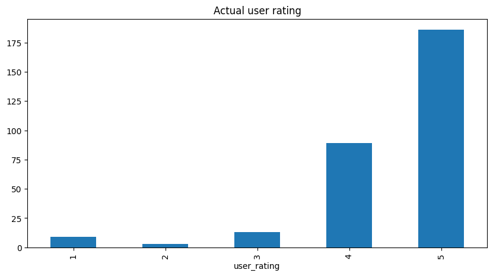
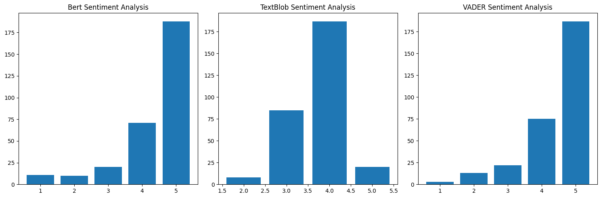

# Sentiment Analysis
### A comparison of BERT vs Rules-based approach

**Project Description:** 

This repository contains code for sentiment analysis on restaurant reviews. The project collects restaurant reviews from TripAdvisor, performs sentiment analysis using various methods, and evaluates the performance of each method. The goal is to analyze customer sentiments and compare different sentiment analysis techniques.

## Table of Contents

1. [Introduction](#introduction)
2. [Data Used](#data-used)
3. [Tools Used](#tools-used)
4. [Installation](#installation)
5. [Usage](#usage)
6. [Results](#results)
7. [Future Prospects](#future-prospects)
8. [Contributing](#contributing)

## Introduction

In this project, we aim to analyze customer sentiments on restaurant reviews to gain insights into customer satisfaction and feedback. Sentiment analysis is performed using three different methods: BERT-based sentiment analysis, TextBlob-based sentiment analysis, and VADER-based sentiment analysis. The project also includes the code for collecting restaurant reviews from TripAdvisor and saving them in a CSV file.

## Data Used

The project collects restaurant reviews from TripAdvisor for a specific restaurant. The data includes the review date, user rating, review title, and the review itself. The reviews are obtained by web scraping TripAdvisor using BeautifulSoup library in Python.

## Tools Used

The following tools and libraries are used in this project:

- `Python`: The entire project is implemented in Python programming language.
- `pandas`: Used for data manipulation and handling.
- `numpy`: Required for numerical computations.
- `sklearn`: Utilized for performance evaluation metrics like confusion matrix and classification report.
- `matplotlib`: Used for data visualization, particularly for generating bar plots.
- `torch`: Required for using the BERT-based sentiment analysis model.
- `transformers`: Used for loading the pre-trained BERT model and tokenizer.
- `requests`: Used for making HTTP requests to scrape TripAdvisor reviews.
- `BeautifulSoup`: Used for parsing the HTML content of TripAdvisor pages.
- `re`: Required for regular expression operations.
- `math`: Required for mathematical operations like ceil.
- `nltk`: Used for natural language processing tasks, including the VADER sentiment analysis tool.
- `textblob`: Used for sentiment analysis and text processing tasks.
- `vader`: The VADER sentiment analysis tool provided by the NLTK library.

The choice of these tools is based on their popularity, ease of use, and effectiveness in achieving the project goals.

## Installation

To run the code in this project, you can choose one of the following installation methods:

### Using pip

1. Clone the GitHub repository to your local machine.
2. Ensure you have Python 3.x installed on your system.
3. Install the required Python packages using `pip` by running the following command:
```bash
pip install pandas numpy scikit-learn matplotlib torch transformers requests beautifulsoup4 nltk textblob
```

4. Additionally, download the VADER lexicon used by the NLTK library by running the following Python command:

```python
import nltk
nltk.download('vader_lexicon')
```
### Using Poetry

1. Clone the GitHub repository to your local machine.
2. Install [Poetry](https://python-poetry.org/) if you haven't already. Poetry is a dependency manager for Python projects.
3. Navigate to the project's root directory in the terminal.
4. Run the following command to install the required dependencies using Poetry:

```bash
poetry install
```
Poetry will read the `pyproject.toml` file and install all the required packages, including those specified in the `dev-dependencies` section.

5. Additionally, download the VADER lexicon used by the NLTK library by running the following Python command:

```python
poetry run python -m nltk.downloader vader_lexicon
```


## Usage

To use the code in this project, follow these steps:

1. Replace the `url` variable in the code with the TripAdvisor URL of the restaurant for which you want to analyze the reviews.

2. Optionally, you can set the `max_reviews` variable to limit the number of reviews collected from TripAdvisor. By default, it is set to 300.

3. Run the code in your Python environment. The TripAdvisor reviews will be collected, sentiment analysis will be performed using BERT, TextBlob, and VADER methods, and the results will be displayed.

4. The code will save the collected reviews and their sentiments in a CSV file named `paragon_reviews_300.csv` in the same directory as the script.

## Results

The project generates bar plots to compare the sentiments obtained from BERT, TextBlob, and VADER methods with the actual user ratings. These plots provide a visual comparison of the sentiment analysis methods' performance.

- **Actual User Rating:**



- **BERT vs TextBlob vs VADER Sentiment Analysis:**



The project also prints out the accuracy, confusion matrix, and classification report for each sentiment analysis method.

## Future Prospects

This project can be extended and improved in various ways:

1. **More Data:** Collect a larger dataset of reviews from multiple restaurants to improve the robustness of the sentiment analysis models.

2. **Fine-Tuning BERT:** Fine-tune the BERT model on a custom sentiment analysis dataset specific to the restaurant domain to enhance the performance.

3. **Aspect-Based Sentiment Analysis:** Perform aspect-based sentiment analysis to identify sentiments related to specific aspects of the restaurant (e.g., food, service, ambiance).

4. **Real-Time Analysis:** Implement real-time sentiment analysis to analyze live reviews as they are posted on online platforms.

5. **User Interface:** Develop a user interface or web application that allows users to input a restaurant's URL and view the sentiment analysis results in an interactive manner.

6. **Expnad Web Scraping:** Use Selenium or other tools to extract complete reviews from page two onwards which are hidden by default and are obtained by clickin '...more'.

## Contributing

Contributions to this project are welcome. If you have any ideas, improvements, or bug fixes, feel free to open an issue or submit a pull request on GitHub.
